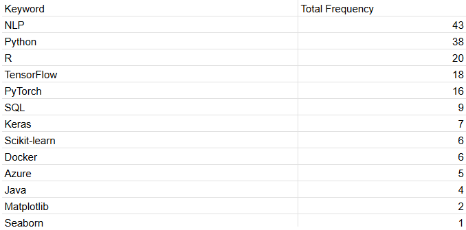
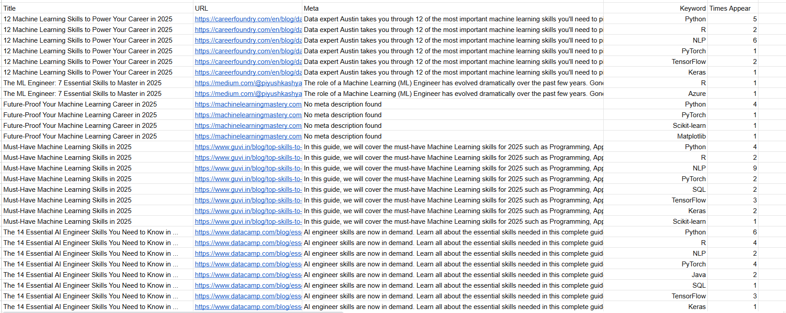
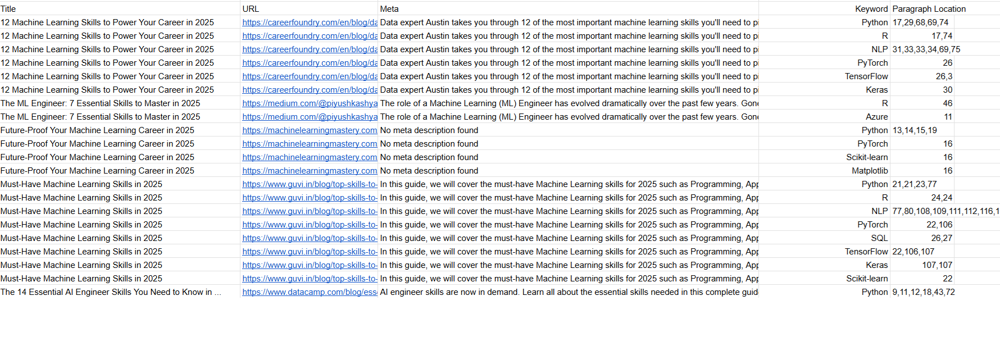

## Project Overview
This project demonstrates how to perform web scraping using Selenium to collect data from Google Search Engine. The goal is to:
*   Extract search results related to "Machine learning skills needed 2025".
* Visit each link found in the search results automatically.
* Analyze content from these articles to identify frequently occurring keywords that are important for aspiring Machine Learning Engineers.
## 💡 Key Features
- **Automated Google Search**: Scrapes the top search results for a given query.
- **Link Navigation**: Automatically visits each website to collect metadata and article content.
- **Keyword Analysis**: Identifies common keywords across all articles, helping understand trending skills in Machine Learning.

---

## 🔧 Technologies Used
- **Python**
- **Selenium** (for web automation)
- **Pandas** (for data handling)

---

## 🚜 How It Works
1. **Search Google**: The script searches Google for the query _"Machine learning skills needed 2025"_.
2. **Extract Links**: Retrieves titles and URLs of search results.
3. **Visit Websites**: Navigates to each link, extracts the meta description, and collects article content.
4. **Analyze Keywords**: Processes the content to find the most common keywords relevant to Machine Learning skills.

---

## 📊 Sample Output

- **Title**: 12 Machine Learning Skills to Power Your Career in 2025
- **Meta Description**: Discover the top ML skills to boost your career.
- **Content**: "Machine learning is evolving rapidly. Key skills include Python, data analysis, deep learning, and cloud computing..."
- **URL**: https://docs.google.com/spreadsheets/d/1sCN784wCwlZgTN-hsYj9jPx8rilXF7A8L67aG6eQa-0/edit?gid=0#gid=0

---

## 🌍 Future Improvements
- Add **Natural Language Processing (NLP)** to improve keyword extraction.
- Enhance error handling for dynamic websites.
- Support multilingual scraping for international content.

